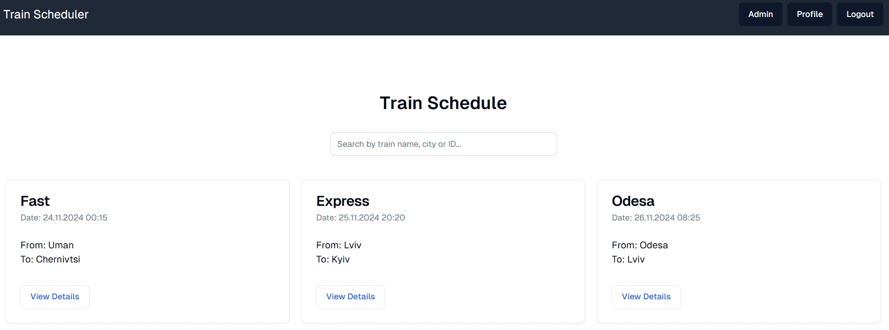
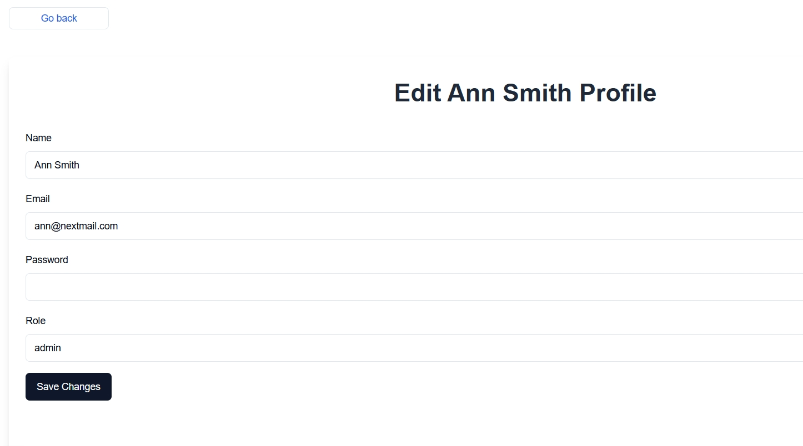
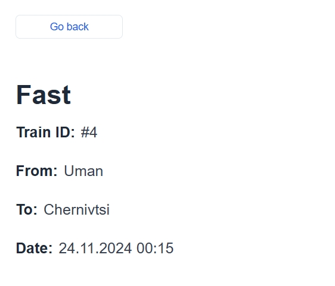
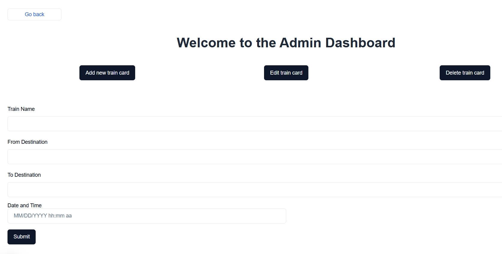

# Train Scheduler

---

     

## About

---

✨ This is very simple web application, which allows you to see available trains. ✨

## Features

---

- The list of all available trains, sorted by date in ascending order
- Login into your account or create one on button click
- Logged user can open profile page and change name, email, password or role
- Users with 'admin' role can have acces to admin page
- On admin page you can add new train, edit or delete existing ones
- Users can search train by name, id or date on main page
- If user don't have access to admin page, they will be redirected to error page
- If you click on train card, you can open train page and see detailed info about this particular train

### How working app looks like

---

> **Note:** By default, all new users have the role 'user'. If you want to test admin features, change manually the role to 'admin'.

